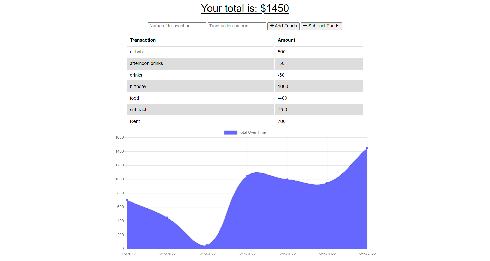

# budget-tracker

## Description

A PWA for online and offline tracking of deposits and withdrawals.  A simple budget tracking tool allowing for both depoists and expenses and following the PWA architecture.

## Technolgoies

* Javascript
* Node.js
* Heroku
* Express
* HTML/CSS
* MongoDB

## Installation

Server must have node.js installed, run `npm i` from the root directory to install required dependencies.

Run `npm start` to start the application.

## Github Repo 

[Link to repository](https://github.com/adambowers09/budget-tracker)

## Screenshot

